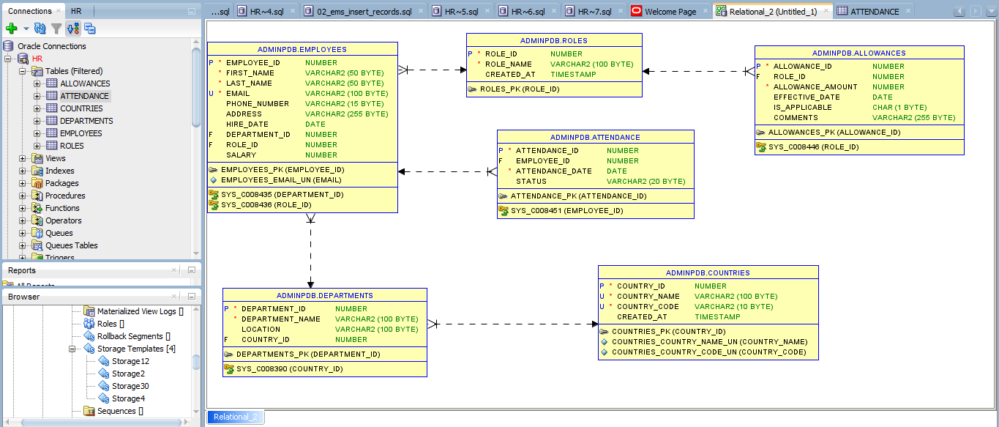

# Employee Management Database (Using Oracle as RDBMS)

This README provides an overview of the Employee Management Database, designed specifically for Oracle courses to manage and store information related to employees and organizational structure. It includes tables for Countries, Departments, Roles, Managers, Employees, Allowance, and Attendance records.

## Table Structures

### Countries Table

```sql
CREATE TABLE Countries (
    Country_ID NUMBER GENERATED BY DEFAULT AS IDENTITY PRIMARY KEY,
    Country_Name VARCHAR2(100) NOT NULL UNIQUE,
    Country_Code VARCHAR2(10) NOT NULL UNIQUE,
    Created_At TIMESTAMP DEFAULT CURRENT_TIMESTAMP
);
```

## Departments Table

```sql
CREATE TABLE Departments (
    Department_ID NUMBER GENERATED BY DEFAULT AS IDENTITY PRIMARY KEY, -- Unique identifier for each department
    Department_Name VARCHAR2(100) NOT NULL,                           -- Name of the department
    Location VARCHAR2(100),                                           -- Physical location of the department
    Country_ID NUMBER,                                               -- Foreign key referencing Countries table
    FOREIGN KEY (Country_ID) REFERENCES Countries(Country_ID)       -- Establishing a relationship with the Countries table
);

```

## Roles Table

```sql

CREATE TABLE Roles (
    Role_ID NUMBER GENERATED BY DEFAULT AS IDENTITY PRIMARY KEY,     -- Unique identifier for each role
    Role_Name VARCHAR2(100) NOT NULL,                               -- Name of the role
    Created_At TIMESTAMP DEFAULT CURRENT_TIMESTAMP                  -- Timestamp of record creation
);
```

## Managers Table

```sql
CREATE TABLE Managers (
    Manager_ID NUMBER GENERATED BY DEFAULT AS IDENTITY PRIMARY KEY,  -- Unique identifier for each manager
    Employee_ID NUMBER UNIQUE,                                       -- Foreign key referencing the Employees table (one-to-one)
    Department_ID NUMBER,                                           -- Foreign key referencing the Departments table
    FOREIGN KEY (Employee_ID) REFERENCES Employees(Employee_ID),     -- Establishing a relationship with the Employees table
    FOREIGN KEY (Department_ID) REFERENCES Departments(Department_ID) -- Establishing a relationship with the Departments table
);
```

## Employees Table
```sql

-- Table containing records of employees
CREATE TABLE Employees (
    Employee_ID NUMBER GENERATED BY DEFAULT AS IDENTITY PRIMARY KEY,  -- Unique identifier for each employee
    First_Name VARCHAR2(50) NOT NULL,                                -- Employee's first name
    Last_Name VARCHAR2(50) NOT NULL,                                 -- Employee's last name
    Email VARCHAR2(100) UNIQUE NOT NULL,                             -- Employee's email (must be unique)
    Phone_Number VARCHAR2(15),                                       -- Employee's phone number
    Address VARCHAR2(255),                                           -- Employee's address
    Hire_Date DATE DEFAULT SYSDATE,                                  -- Date when the employee was hired
    Department_ID NUMBER,                                           -- Foreign key referencing the Departments table
    Role_ID NUMBER,                                                 -- Foreign key referencing the Roles table
    Salary NUMBER,                                                  -- Employee's salary
    FOREIGN KEY (Department_ID) REFERENCES Departments(Department_ID), -- Establishing a relationship with the Departments table
    FOREIGN KEY (Role_ID) REFERENCES Roles(Role_ID)                 -- Establishing a relationship with the Roles table
);
```

## Allowance Table
```sql

CREATE TABLE Allowances (
    Allowance_ID NUMBER GENERATED BY DEFAULT AS IDENTITY PRIMARY KEY,  -- Unique identifier for each allowance record
    Role_ID NUMBER,                                                   -- Foreign key referencing the Roles table
    Allowance_Amount NUMBER NOT NULL,                                 -- Amount of the allowance
    Effective_Date DATE DEFAULT SYSDATE,                              -- Date when the allowance became effective
    Is_Applicable CHAR(1) DEFAULT 'Y' CHECK (Is_Applicable IN ('Y', 'N')), -- Indicator if allowance is applicable
    Comments VARCHAR2(255),                                          -- Additional comments about the allowance
    FOREIGN KEY (Role_ID) REFERENCES Roles(Role_ID)                  -- Establishing a relationship with the Roles table
);

```

## Attendance Table
```sql

CREATE TABLE Attendance (
    Attendance_ID NUMBER GENERATED BY DEFAULT AS IDENTITY PRIMARY KEY, -- Unique identifier for each attendance record
    Employee_ID NUMBER,                                             -- Foreign key referencing the Employees table
    Attendance_Date DATE NOT NULL,                                 -- Date of attendance
    Status VARCHAR2(20) CHECK (Status IN ('Present', 'Absent', 'Leave')), -- Attendance status
    FOREIGN KEY (Employee_ID) REFERENCES Employees(Employee_ID)     -- Establishing a relationship with the Employees table
);
```

# Inserting Records

To insert records into the tables, you can use the following examples:

## Insert Countries

```sql
INSERT INTO Countries (Country_Name, Country_Code) VALUES ('Rwanda', 'RW');  -- Inserting Rwanda
INSERT INTO Countries (Country_Name, Country_Code) VALUES ('Uganda', 'UG');  -- Inserting Uganda
```

## nsert Departments

```sql 
INSERT INTO Departments (Department_Name, Location, Country_ID) VALUES ('Human Resources', 'Kigali', 1);  -- HR department in Rwanda
INSERT INTO Departments (Department_Name, Location, Country_ID) VALUES ('Finance', 'Kigali', 1);  -- Finance department in Rwanda
```
## Insert Roles

```sql
INSERT INTO Roles (Role_Name) VALUES ('Manager');  -- Inserting Manager role
INSERT INTO Roles (Role_Name) VALUES ('Employee');  -- Inserting Employee role

```

## Insert Employees

```sql
INSERT INTO Employees (First_Name, Last_Name, Email, Phone_Number, Address, Hire_Date, Department_ID, Role_ID, Salary)
VALUES ('Alice', 'Kanayana', 'alice@example.com', '+250788123456', 'Kigali, Rwanda', SYSDATE, 1, 1, 50000);  -- Inserting employee Alice
```

## Insert Attendance

```sql
INSERT INTO Attendance (Employee_ID, Attendance_Date, Status) VALUES (1, SYSDATE, 'Present');  -- Attendance record for employee Alice
```

## Conceptual, Logical and Physical Data Model



## Conclusion

This Employee Management Database schema is provided for educational and development purposes. You are free to use, modify, and distribute this code as you see fit, provided that proper attribution is given.

### License

This project is licensed under the [MIT License](https://opensource.org/licenses/MIT). You can freely use, copy, modify, and distribute this software, but please include a copy of this license in any distributions.
