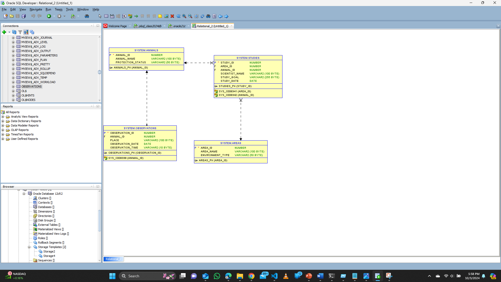

# Employee Management Database (Using Oracle as RDBMS)

This README provides an overview of the Employee Management Database, designed specifically for Oracle courses to manage and store information related to employees and organizational structure. It includes tables for Countries, Departments, Roles, Managers, Employees, Allowance, and Attendance records.

## Table Structures

### Create Animals Table

```sql

CREATE TABLE Animals (
    animal_id NUMBER PRIMARY KEY,
    animal_name VARCHAR2(100),
    protection_status VARCHAR2(50)
);
```

## Create Observations Table

```sql

CREATE TABLE Observations (
    observation_id NUMBER PRIMARY KEY,
    animal_id NUMBER,
    place VARCHAR2(100),
    observation_date DATE,
    observation_time VARCHAR2(10),
    FOREIGN KEY (animal_id) REFERENCES Animals(animal_id)
);

```

## Create Areas Table

```sql


CREATE TABLE Areas (
    area_id NUMBER PRIMARY KEY,
    area_name VARCHAR2(100),
    environment_type VARCHAR2(50)
);
```

## Create Studies Table

```sql

CREATE TABLE Studies (
    study_id NUMBER PRIMARY KEY,
    area_id NUMBER,
    animal_id NUMBER,
    scientist_name VARCHAR2(100),
    study_goal VARCHAR2(255),
    study_date DATE,
    FOREIGN KEY (area_id) REFERENCES Areas(area_id),
    FOREIGN KEY (animal_id) REFERENCES Animals(animal_id)
);
```

## Employees Table
```sql

-- Table containing records of employees
CREATE TABLE Employees (
    Employee_ID NUMBER GENERATED BY DEFAULT AS IDENTITY PRIMARY KEY,  -- Unique identifier for each employee
    First_Name VARCHAR2(50) NOT NULL,                                -- Employee's first name
    Last_Name VARCHAR2(50) NOT NULL,                                 -- Employee's last name
    Email VARCHAR2(100) UNIQUE NOT NULL,                             -- Employee's email (must be unique)
    Phone_Number VARCHAR2(15),                                       -- Employee's phone number
    Address VARCHAR2(255),                                           -- Employee's address
    Hire_Date DATE DEFAULT SYSDATE,                                  -- Date when the employee was hired
    Department_ID NUMBER,                                           -- Foreign key referencing the Departments table
    Role_ID NUMBER,                                                 -- Foreign key referencing the Roles table
    Salary NUMBER,                                                  -- Employee's salary
    FOREIGN KEY (Department_ID) REFERENCES Departments(Department_ID), -- Establishing a relationship with the Departments table
    FOREIGN KEY (Role_ID) REFERENCES Roles(Role_ID)                 -- Establishing a relationship with the Roles table
);
```


# Inserting Records

To insert records into the tables, you can use the following examples:

## Insert Animals Data

```sql

INSERT INTO Animals (animal_id, animal_name, protection_status)
VALUES (1, 'Mountain Gorilla', 'Critically Endangered');

INSERT INTO Animals (animal_id, animal_name, protection_status)
VALUES (2, 'Golden Eagle', 'Least Concern');
```

## Insert Areas Data

```sql 

INSERT INTO Areas (area_id, area_name, environment_type)
VALUES (1, 'Virunga', 'Rainforest');

INSERT INTO Areas (area_id, area_name, environment_type)
VALUES (2, 'Rocky Mountains', 'Alpine');
```
## Insert Observations

```sql
-- 
INSERT INTO Observations (observation_id, animal_id, place, observation_date, observation_time)
VALUES (1001, 1, 'Virunga National Park', TO_DATE('2023-07-15', 'YYYY-MM-DD'), '10:30');

INSERT INTO Observations (observation_id, animal_id, place, observation_date, observation_time)
VALUES (1002, 2, 'Rocky Mountain Range', TO_DATE('2023-08-22', 'YYYY-MM-DD'), '14:00');


```

## Insert Studies Data

```sql

INSERT INTO Studies (study_id, area_id, animal_id, scientist_name, study_goal, study_date)
VALUES (2001, 1, 1, 'Dr. Emily Green', 'Analyze gorilla family dynamics', TO_DATE('2023-07-20', 'YYYY-MM-DD'));

INSERT INTO Studies (study_id, area_id, animal_id, scientist_name, study_goal, study_date)
VALUES (2002, 2, 2, 'Dr. Mark Brown', 'Monitor eagle nesting patterns', TO_DATE('2023-08-25', 'YYYY-MM-DD'));
```

## Retrieve animal names and protection status

```sql

SELECT animal_name, protection_status FROM Animals;

```
## Retrieve animal observation details
```sql
SELECT a.animal_name, o.place, o.observation_date, o.observation_time
FROM Animals a
JOIN Observations o ON a.animal_id = o.animal_id;

## Retrieve study details with animals
```sql
SELECT a.animal_name, s.scientist_name, s.study_goal, s.study_date
FROM Animals a
JOIN Studies s ON a.animal_id = s.animal_id;

```

## Transactions and Operations
## Update protection status of an animal
```sql
UPDATE Animals
SET protection_status = 'Endangered'
WHERE animal_name = 'Mountain Gorilla';

```

## Delete study data by scientist
```sql
DELETE FROM Studies
WHERE scientist_name = 'Dr. Mark Brown';
```

## Conceptual, Logical and Physical Data Model



